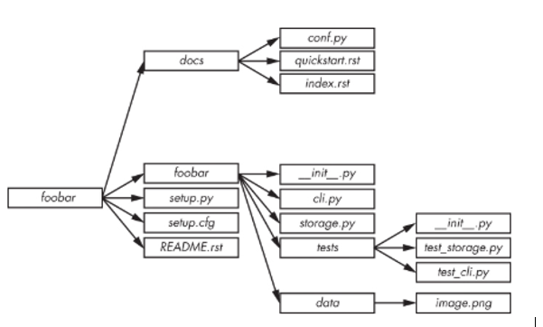

# Creating a project

## Structure

- Units tests should be installed in the packages so that they are available for other sub packages.
- Organize your code based on features not type
- Building a deep hierarchy is confusing
- Whatever code you put in the **\_\_init\_\_.py** file will be executed when the module is loaded, so be careful.

## Additional Files

- README.rst
- LICENSE
- README
- .gitignore
- setup.py
- requirements.txt
- sample/\_\_init\_\_.py
- sample/core.py
- sample/helpers.py
- docs/conf.py
- docs/index.md
- tools (for shell scripts or related tools)
- bin (binary scripts installed with setup.py)
- etc (sample configuration files)

## Code

PEP8

## Versioning

PEP 440 Standard

`$ git init`

## Installing required modules

`pip freeze requirements.txt`

`pip install -r requiremts.txt`

`conda env create env.yml`

## Prompt

`prompt $$$S`

`prompt $P$G`
